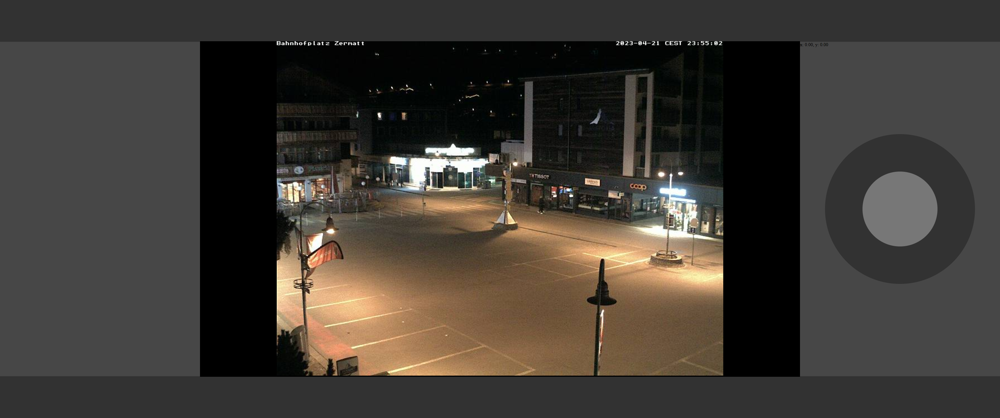

# Webhmi

Web based touch HMI to control different robots

## Requirements
- Python3: `sudo apt install python3`
- Pip: `sudo apt install python3-pip`
- Flask: `pip install Flask `
- OpenCV: `pip install opencv-python`

## Usage
    python3 app.py

## TODO
- [x] Add video feed
- [x] Add buttons
- [ ] Make widgets movable in runtime
- [x] Add indicators for battery and wifi signal (Will add it as a message)
- [ ] Add menu
- [ ] Integrate ROS2
- [x] Compress video
